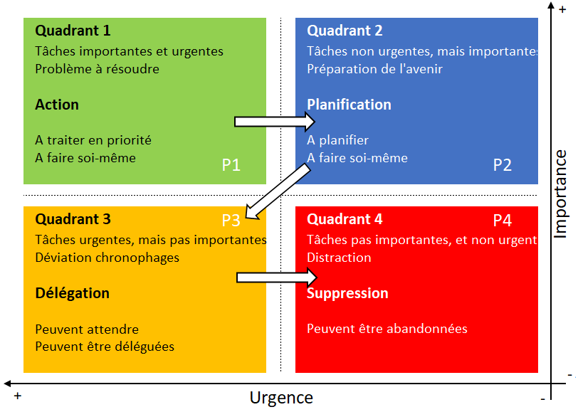

# Matrice Eisenhower  

La matrice d'Eisenhower est un outil d'analyse et de gestion du temps qui permet de classer les tâches à faire en fonction de leur urgence ainsi que de leur importance. Cet outil nous permet de mieux hiérarchiser nos priorités et d'y voir un peu plus clair quand on début un projet.

On représente la matrice par 4 quadrants que sépare 2 axes :

-  L'axe horizontal représente le niveau d'urgence des tâches.  
-  L'axe verticale représente l'importance des tâches.  

Il y a différente façon de représenter les axes mais habituellement sur l'axe horizontale plus la tâche se situe sur vers la droite et plus elle est urgente. Sur l'axe vertical les tâches les plus importantes sont situées vers le haut.

  

Pour utiliser la matrice d'Eisenhower, nous devons commencer par classifier nos activités par degré d'urgence et d'importance.

-  Les activités urgentes requièrent une action immédiate. Ne pas les faire peut avoir des conséquences immédiates sur le projet.  
-  Les activités importantes font parties de nos objectifs, ou leur réalisation permette d’atteindre nos objectifs.  

Cette classification est particulièrement importante, car nous avons tendances à nous focaliser sur la réalisation des tâches urgentes sans égard de leur importance. On se retrouve à réaliser des tâches sans faire avancer notre objectif.

Selon leur niveau d'urgence et d'importance chaque tâches se retrouvera ensuite dans un des quatres quadrants.

## Quadrant 1 - À faire en priorité

Urgentes et importantes

On regroupe ici:

- les tâches importantes et urgentes qui demande une attention immédiate; 
- les éléments qui ont un impact direct sur vos objectifs ou sur l'avancement de votre projet; 
- les problèmes à résoudre de toute urgence.  

## Quadrant 2 : À planifier

Non urgentes et mais importantes

Ce quadrant contient les tâches importantes à la réalisation de notre objectif, mais moins urgentes que celles du premier quadrant. On peut plannifier l'exécution de ces tâches dans un avenir rapprocher sans impact.

# Quadrant 3 : À déléguer

Urgentes mais non importantes

Les tâches non importantes, mais urgentes. Autrement dit des tâches qui requiert une attention immédiate mais qui n'ont pas d'impact sur notre objectif, comme :

- le traitement de certains courriels et messages;  
- la demande de collègue ayant besoin d'une information urgente, d'un conseil, d'un coup de main;  
- les tâches importantes pour d'autres, mais qui n'ont aucune importance pour vous et l'avancement de votre travail;  
- les éléments que vous pouvez déléguer à une tierce personne.  

# Quadrant 4 : À abandonner

Non urgentes et non importantes

Les tâches non importantes et non urgentes. Ce derner quadrant concerne tous les éléments parasites et inutiles que vous devez abandonner pour plus d'efficacité. Toutes ces petites choses qui vous font perdre votre temps et vous éloigne de votre objectif.

# Mediagraphie

    Asana. (s. d.). La matrice d’Eisenhower : L’outil incontournable pour mieux gérer vos priorités [2023] • Asana. Asana. Consulté 13 août 2024, à l’adresse https://asana.com/fr/resources/eisenhower-matrix
    GEORJON, E. (2017, avril 29). La matrice d’Eisenhower. https://emmanuelgeorjon.com/project/la-matrice-deisenhower/
    Matrice d’Eisenhower. (2023). In Wikipédia. https://fr.wikipedia.org/w/index.php?title=Matrice_d%27Eisenhower&oldid=205516373
    Matrice d’Eisenhower : Prioriser pour un gain de temps et de productivité. (s. d.). Consulté 13 août 2024, à l’adresse https://www.manager-go.com/efficacite-professionnelle/dossiers-methodes/matrice-eisenhower
