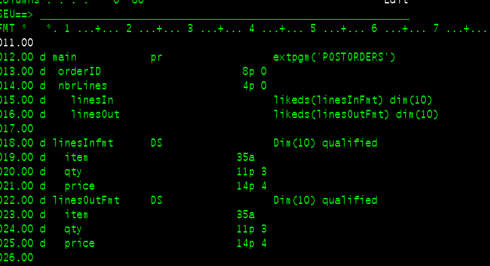

# Veille technologique  

## Qu'est-ce que la veille technologique  

La veille technologique se décrit comme une série d'actions :  

- Surveiller les développements de la technologie  
- Évaluer les facteurs de risques lors du choix d'une technologie  
- S'informer de façon systématique sur les techniques les plus récentes  

## Pourquoi une veille technologique  

Une veille technologique a plusieurs buts :  

- Rester à jour  
- Découvrir la prochaine technologie à utiliser dans un projet  

Rester à jour est essentiel en TI.  Le domaine évolue rapidement et faire sa veille permet de ne pas devenir désuet.  De plus, c'est motivant d'en apprendre plus sur les nouvelles technologies ou la nouvelle version de son langage préféré.  Faire une veille pour rester à jour doit être continuelle.  

En entreprise, le démarrage d'un projet se doit de passer par une veille technologique, pour utiliser des outils courants qui seront utilisés et maintenus dans le futur.  Imaginez faire un projet en RPG/400 en 2021!  

!!! figure "RPG/400"
    
    Quel bel éditeur de code! Nous avions le mode nuit en 1995!    

## Sources d'information  

- Sites Web (voir quelques exemples dans [Outils/Sites](sites.md))  
- Médias sociaux (Twitter et Reddit)  
- Experts du domaine  
- Collègues et amis  
- Livres  
- Revues  
- Fournisseurs  

En entreprise, les fournisseurs peuvent donner une grande quantité d'informations pertinentes et dans plusieurs cas peuvent aider à faire une preuve de concept.  

## Démarche  

Voici les grandes étapes pour une veille technologique dans le cadre d'un projet :  

- [Identification des besoins](identification-des-besoins.md)  
- [Recherche](recherche.md)  
- Recueillir l'information  
- Analyse  
- Prototype ou preuve de concept  
- Tests  
- Rapport  

## Références  

Lagacé, C. (2019). Veille technologique. [https://apical.xyz/formations/veille_techno#chapitre-grilles_de_correction_002](https://apical.xyz/formations/veille_techno#chapitre-grilles_de_correction_002)  

OQLF. (2009). Définition de veille technologique. Grand dictionnaire terminologique. [http://gdt.oqlf.gouv.qc.ca/ficheOqlf.aspx?Id_Fiche=8869935](http://gdt.oqlf.gouv.qc.ca/ficheOqlf.aspx?Id_Fiche=8869935)  

Soyes, A. (2021). Veille technologique : Le guide pour les développeurs. [https://alexsoyes.com/veille-technologique/](https://alexsoyes.com/veille-technologique/)  
