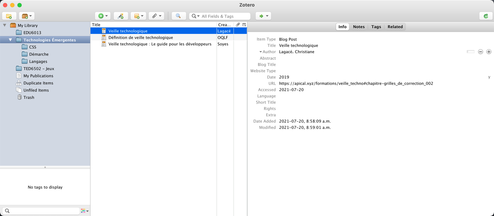
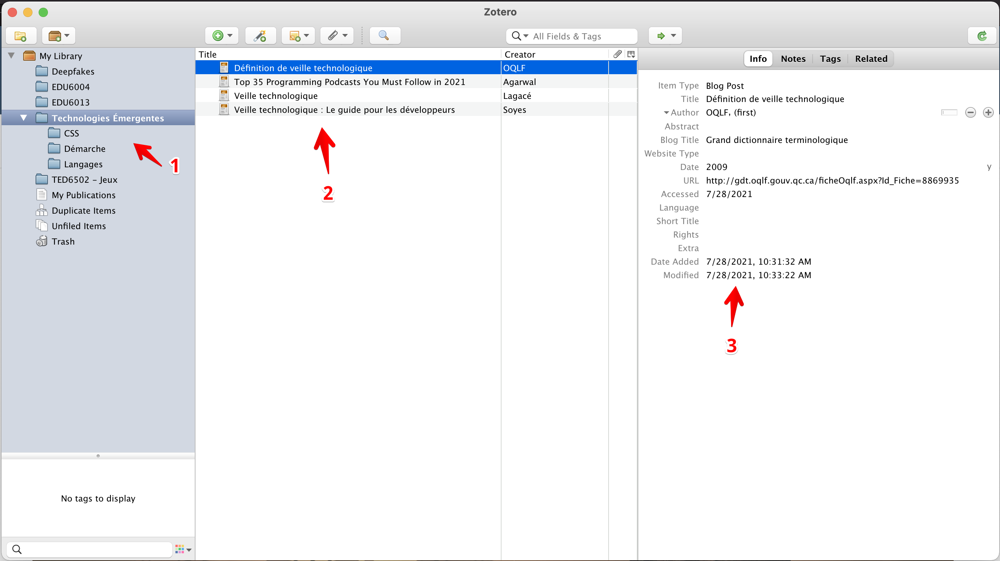
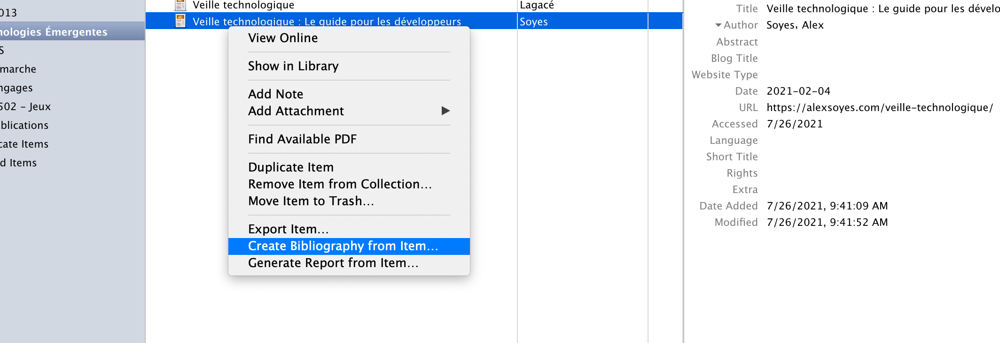
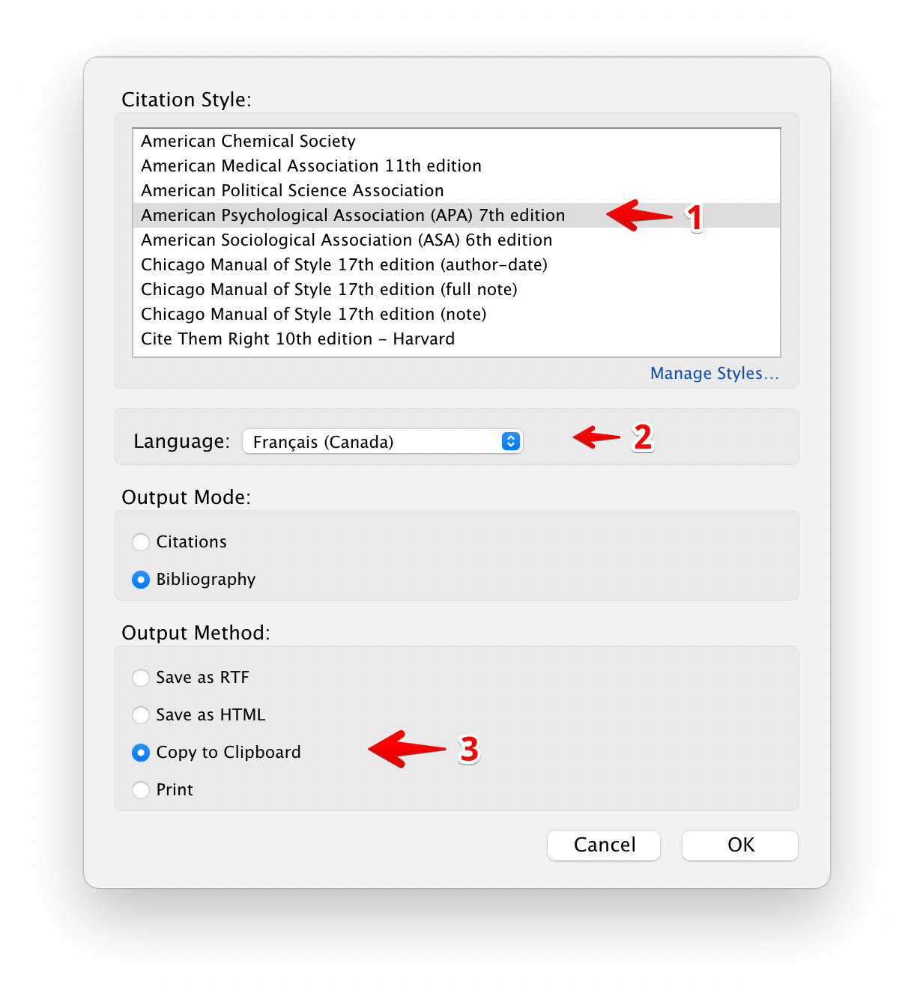

# Zotero

Zotero est une base de données de références pour vos recherches.

!!! figure "Concept central"

La collection de références pour la veille technologique

!!! figure "Éléments de Zotero"

1. Les collections. Conservez vos références dans des collections pour divers projets de recherche.
2. Les références. Toutes les références d'une collection se retrouvent dans cette liste.
3. Le détail d'une référence.

Vous pouvez ajouter des références de tout types, que ce soit des articles dans une revue, des livres ou des entrées de Blog.

!!! important  
 Alimentez Zotero avec le plus d'informations que vous pouvez, incluant les noms des auteurs, l'année de parution et la provenance de l'article.

## Créer une bibliographie

Dans vos travaux, vous aurez à citer vos sources. Avec Zotero, vous pouvez créer une entrée bibliographique à partir du menu contextuel.

!!! figure "Menu contextuel"

!!! figure "Création de bibliographie"

1. Utiliser l'APA.
2. Utiliser le français (Canada).
3. Copier dans le presse-papier.
